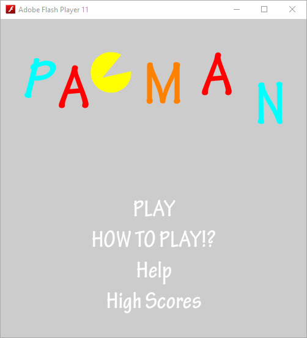
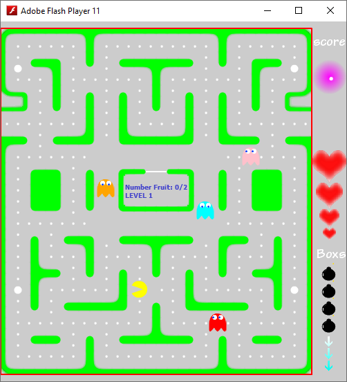
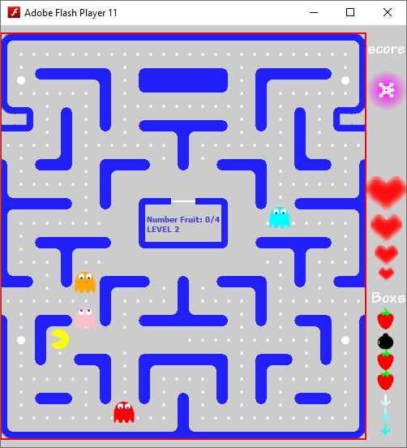
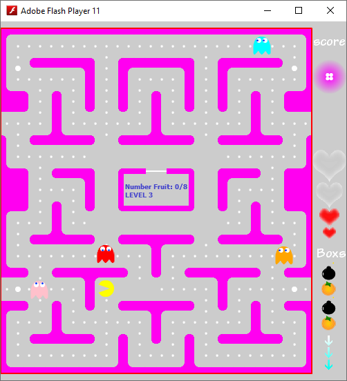
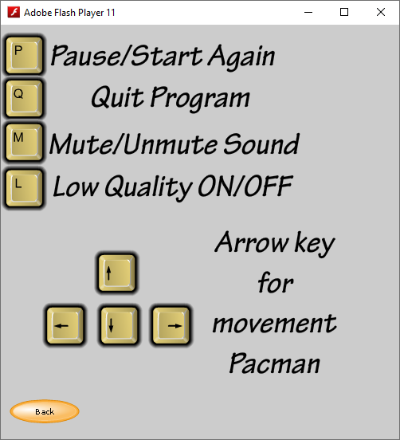
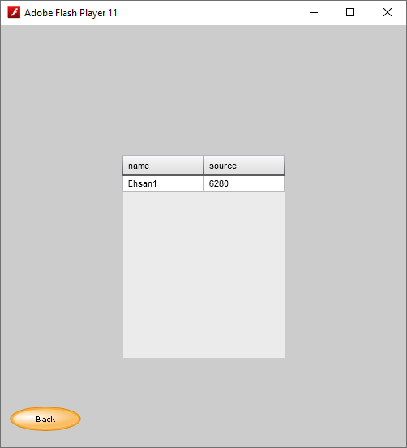

# 🎮 PACMAN Flash Edition – Commercial Release

🎬 [Watch Demo Video](https://besparweb.com/pacman_game)

This game is powered by a **new custom hybrid AI algorithm** designed and implemented by me, combining multiple existing AI techniques into a novel decision-making system for enemy agents.  
It was originally developed as part of my undergraduate thesis in 2016, and now restructured for commercial and educational presentation.

📄 A comprehensive PDF document is included, containing full technical documentation and design rationale.  
🎓 The project also serves as an educational resource for learning about game logic, agent behavior, and Flash-based development.

🧠 The core AI algorithm used in this game is scheduled for academic publication.  
It is a lightweight, high-performance, surprise-oriented decision-making system designed for real-time agent behavior in grid-based environments.  
The algorithm will be featured in a state-of-the-art research paper with industrial relevance, covering applications in game AI, robotics, and decentralized multi-agent coordination.  
📄 [Read the upcoming paper](#) – *Coming soon*

🧩 The game features **three levels**, each with increasing complexity and strategic challenge.

🌐 [Ehsan Lesani – Official Site](https://besparweb.com/)

📁 This project is part of a structured GitHub repository containing source code, documentation, and demo assets.

## 🧠 Background

Originally developed as part of my B.Sc. thesis in Computer Engineering, this game introduced me to game logic, UI design, and event-driven programming.  
Now restructured and published as a commercial-style project to showcase legacy-to-professional transformation.

## 🚀 Features

- Custom maze and ghost behavior
- Fruit collection and level progression
- Score tracking and life system
- Flash-based UI with interactive menus

## 📷 Screenshots

## 🛠️ Technologies

- Adobe Flash Player 11  
- ActionScript 3  
- Basic game loop and collision detection

## 📚 Legacy Note

This project was originally created in 2016 and is now published as part of my professional archive.  
It reflects the early stages of my journey into AI, game logic, and system architecture.

## 📚 Publication Notice

The `docs/` folder in this repository may include selected cover pages, abstracts, or tables of contents from academic works for reference only.  
**Full texts are not included** and are not redistributed.  
All rights remain with the original authors and publishers.

For full access, please refer to the official publication links or contact the authors directly.

## 📄 License

This project is released under the MIT License.

## 🌐 Author

**Ehsan Lesani**  
AI Solutions Architect | AI Engineer | Full-Stack Dev | Remote-first CTO | AI Agents Development  
🔗 [Official Site](https://besparweb.com)  
📂 [Linkedin Profile](https://www.linkedin.com/in/ehsan-lesani-ai)  
📧 [Contact for Commercial Collaboration](mailto:ehsan.lesani.ai@gmail.com?subject=AI%20Project%20Execution%20Request)
